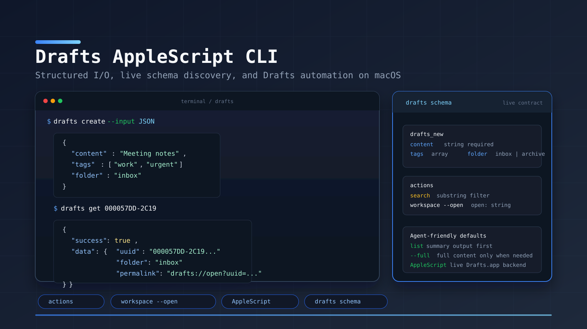

# Drafts AppleScript CLI

<p align="center">
  
</p>

Command line interface for [Drafts](https://getdrafts.com) on macOS.

## Requirements

> **IMPORTANT: This CLI only works on macOS with Drafts running.**

| Requirement | Details |
|-------------|---------|
| **Operating System** | macOS only (uses AppleScript) |
| **Drafts App** | Must be installed AND running |
| **Drafts Pro** | Required for automation features |
| **Go** | 1.21+ (for installation) |

**This CLI will NOT work if:**
- You're on Linux or Windows
- Drafts app is not installed
- Drafts app is not running (it must be open)
- You don't have Drafts Pro subscription

## How It Works

The CLI communicates with Drafts via AppleScript (`osascript`). This means:
- Drafts must be running on your Mac for any command to work
- Commands execute in the context of the running Drafts app
- All data stays local on your Mac

The exposed command surface is intentionally limited to what the live Drafts AppleScript dictionary actually supports. Draft syntax/language grammar is not part of the AppleScript dictionary, so it is not surfaced by this CLI.

## Install

### Option 1: Go Install

```bash
go install github.com/nerveband/drafts-applescript-cli/cmd/drafts@latest
```

### Option 2: Build from Source

```bash
git clone https://github.com/nerveband/drafts-applescript-cli
cd drafts-applescript-cli
go build ./cmd/drafts

# Optionally move to PATH
mv drafts /usr/local/bin/
```

### Option 3: Download Binary

Download from [Releases](https://github.com/nerveband/drafts-applescript-cli/releases) (macOS only).

## Quick Start

```bash
# Make sure Drafts is running first!
open -a Drafts

# Create a draft
drafts create "Hello from the CLI"

# List your drafts
drafts list

# Get a specific draft
drafts get <uuid>
```

## Usage

```
$ drafts --help
Drafts CLI - Interact with Drafts.app from the command line

Requires: macOS, Drafts.app running, Drafts Pro subscription

Usage: drafts [--plain] <command> [<args>]

Options:
  --plain              output plain text instead of JSON
  --help, -h           display this help and exit

Commands:
  new                  create new draft
  create               create new draft (alias for 'new')
  prepend              prepend to draft
  append               append to draft
  replace              replace content of draft
  edit                 edit draft in $EDITOR
  get                  get content of draft
  select               select active draft using fzf
  list                 list drafts
  flag                 flag a draft
  unflag               unflag a draft
  workspace            show, list, or open workspaces
  actions              list available actions
  run                  run a Drafts action
  info                 show environment info and diagnostics
  schema               output tool-use schema for LLM integration
  upgrade              upgrade to the latest version
  version              show version information

Documentation:
  Repository:     https://github.com/nerveband/drafts-applescript-cli
  Report issues:  https://github.com/nerveband/drafts-applescript-cli/issues
  Drafts docs:    https://docs.getdrafts.com
```

## Commands

### create / new

Create a new draft.

```bash
drafts create "Content here" [options]

Options:
  -t, --tag TAG        Add tag (can be used multiple times)
  -a, --archive        Create in archive folder
  -f, --flagged        Create as flagged
  --action ACTION      Run action after creation
  --input JSON         Raw JSON payload; use '-' to read from stdin
```

**Examples:**
```bash
drafts create "Meeting notes"
drafts create "Shopping list" -t groceries -t todo
drafts create "Important!" -f
drafts create --input '{"content":"Ship types, not docs","tags":["ideas","cli"]}'
```

### get

Get a draft by UUID.

```bash
drafts get [UUID]      # Omit UUID to get active draft
```

### list

List drafts with optional filtering.

```bash
drafts list [options]

Options:
  -f, --filter FILTER  Filter: inbox|flagged|archive|trash|all (default: inbox)
  -t, --tag TAG        Filter by tag (can be used multiple times)
  -s, --search TEXT    Search draft content
  -w, --workspace NAME Filter by workspace name
  --limit N            Maximum drafts to return (default: 20, use 0 for all)
  --full               Include full content and location fields
```

`drafts list` now returns token-cheaper summaries by default. Use `--full` when you actually need the full draft body and location fields.

**Examples:**
```bash
drafts list                    # List inbox
drafts list -f archive         # List archived
drafts list -t work            # Filter by tag
drafts list -s "meeting"       # Search content
drafts list -w "My Workspace"  # Filter by workspace
drafts list --limit 5          # Cap result size
drafts list --full -t work     # Include full content
```

### flag / unflag

Toggle flagged status on a draft.

```bash
drafts flag [UUID]             # Flag (omit UUID for active draft)
drafts unflag [UUID]           # Unflag (omit UUID for active draft)
```

### workspace

Show current workspace, list all workspaces, or open one by name.

```bash
drafts workspace               # Show current workspace
drafts workspace --list        # List all workspaces
drafts workspace --open Ideas  # Open a workspace by name
```

### actions

List available Drafts actions.

```bash
drafts actions
drafts actions -s Copy
```

### prepend / append

Add content to an existing draft.

```bash
drafts prepend "Text" -u UUID [options]
drafts append "Text" -u UUID [options]

Options:
  -u, --uuid UUID      Target draft UUID (omit to use active draft)
  -t, --tag TAG        Add tag
  --action ACTION      Run action after modification
  --input JSON         Raw JSON payload; use '-' to read from stdin
```

### replace

Replace entire content of a draft.

```bash
drafts replace "New content" -u UUID
drafts replace --input '{"uuid":"<uuid>","content":"New content"}'
```

### edit

Open draft in your $EDITOR.

```bash
drafts edit [UUID]     # Omit UUID to edit active draft
```

### run

Run a Drafts action.

```bash
drafts run "Action Name" "Text to process"
drafts run "Action Name" -u UUID    # Run on existing draft
drafts run --input '{"action":"Copy","uuid":"<uuid>"}'
```

### info

Show environment information and diagnostics. **Run this first** to verify your setup.

```bash
drafts info                    # Basic info
drafts info --verbose          # Include full lists of actions, tags, workspaces
drafts info --test-permissions # Test what operations work
```

**Example output:**
```json
{
  "success": true,
  "data": {
    "cli": {"version": "2.1.0", "os": "darwin", "arch": "arm64"},
    "drafts_app": {"running": true, "version": "47.1", "pro": true},
    "counts": {"inbox": 142, "flagged": 8, "archive": 1203, "trash": 12, "all": 1357},
    "available_tags": ["work", "personal", "ideas"],
    "recent_drafts": [{"uuid": "ABC123", "title": "Meeting notes", "modified": "..."}]
  }
}
```

### schema

Output tool-use schema for LLM integration.

```bash
drafts schema          # Full schema
drafts schema create   # Schema for specific command
```

### upgrade

Upgrade to the latest version from GitHub releases.

```bash
drafts upgrade         # Check for and install updates
```

### version

Show version information.

```bash
drafts version         # Display current version
```

## Output Formats

**JSON (default)** - Structured output for programmatic use:
```json
{
  "success": true,
  "data": {
    "uuid": "ABC-123",
    "content": "Note content",
    "title": "Note title",
    "tags": ["tag1"],
    "isFlagged": false,
    "isArchived": false,
    "isTrashed": false,
    "folder": "inbox",
    "createdAt": "2026-01-29 10:00:00",
    "modifiedAt": "2026-01-29 10:30:00",
    "permalink": "drafts://open?uuid=ABC-123"
  }
}
```

For `drafts list`, the default JSON omits `content` and location fields unless you pass `--full`.

**Plain text** - Human-readable output:
```bash
drafts list --plain
```

## LLM Integration

This CLI is designed for LLM tool use:

- **JSON output by default** - Easy to parse
- **Structured errors** - Error code, message, and recovery hints
- **Typed command schema** - Get schema with `drafts schema`
- **Raw JSON input** - Mutating commands accept `--input`
- **Smaller default reads** - `drafts list` returns summaries unless `--full`
- **Self-diagnostics** - `drafts info` shows environment status
- **Auto-update notifications** - CLI notifies when updates available

### For LLMs and Automated Agents

**Before starting any workflow:**

```bash
# 1. Check environment status
drafts info

# 2. If issues or missing features, upgrade
drafts upgrade

# 3. Verify version
drafts version
```

**When to run `drafts upgrade`:**
- Before starting new tasks or workflows
- After encountering unexpected errors
- When documentation mentions features not available in your version
- When you see "Update available" notification
- Periodically to stay up to date with latest improvements

**When to run `drafts info`:**
- At the start of any session to verify Drafts is running
- After errors to diagnose environment issues
- To discover available actions, tags, and workspaces
- To verify Pro subscription is active

**Error handling workflow:**
```bash
# If a command fails unexpectedly:
1. Run 'drafts info' to check environment
2. Check if Drafts.app is running
3. Run 'drafts upgrade' to get latest fixes
4. Retry the command
```

### Error Codes Reference

| Code | Meaning | Resolution |
|------|---------|------------|
| `DRAFT_NOT_FOUND` | UUID doesn't match any draft | Use `drafts list` to find valid UUIDs |
| `DRAFTS_NOT_RUNNING` | Drafts.app not running | Run `open -a Drafts` |
| `PERMISSION_DENIED` | Automation permission denied | Check System Settings > Privacy > Automation |
| `ACTION_NOT_FOUND` | Named action doesn't exist | Use `drafts actions` to list actions |
| `WORKSPACE_NOT_FOUND` | Named workspace doesn't exist | Use `drafts workspace --list` |
| `INVALID_INPUT` | Mixed or malformed raw input | Check `drafts schema <command>` or `--help` |
| `INVALID_FILTER` | Unsupported list filter | Use one of `inbox`, `flagged`, `archive`, `trash`, `all` |
| `PRO_REQUIRED` | Feature requires Drafts Pro | Subscribe to Drafts Pro |

### AI Agent Skill

An AI agent skill file is included in this repo at [`skills/SKILL.md`](skills/SKILL.md). This skill teaches AI agents (Claude Code, ClawdBot, etc.) how to use the Drafts CLI.

**To install:**
```bash
# Copy to your skills directory
cp skills/SKILL.md ~/.config/skillshare/skills/drafts/SKILL.md

# Or for ClawdBot
cp skills/SKILL.md ~/.clawdbot/skills/drafts/SKILL.md
```

## Troubleshooting

**Quick diagnosis:** Run `drafts info` to see environment status and identify issues.

### "AppleScript error" or no response

1. **Is Drafts running?** The app must be open: `open -a Drafts`
2. **Is Drafts Pro active?** Automation requires Pro subscription
3. **Permissions granted?** Go to System Settings > Privacy & Security > Automation and ensure Terminal (or your app) can control Drafts

**Automated check:**
```bash
drafts info --test-permissions
```

### "command not found: drafts"

Add to your PATH:
```bash
export PATH="$PATH:$(go env GOPATH)/bin"
```

### Commands hang or timeout

Drafts may be showing a dialog. Check the Drafts app window.

### Unexpected errors or missing features

```bash
# Check current version
drafts version

# Upgrade to latest
drafts upgrade

# Verify environment
drafts info
```

### Permission denied errors

```bash
# Test what permissions you have
drafts info --test-permissions
```

If permissions fail:
1. Open System Settings > Privacy & Security > Automation
2. Find your terminal app (Terminal, iTerm, etc.)
3. Ensure "Drafts" is checked
4. Restart your terminal

## Architecture

```
┌─────────────┐      AppleScript      ┌─────────────┐
│  drafts CLI │ ──────────────────▶   │  Drafts.app │
└─────────────┘      (osascript)      └─────────────┘
```

- No network requests
- No helper apps
- No Drafts actions to install
- Pure local AppleScript communication

## Development

```bash
go build ./cmd/drafts    # Build
go test ./...            # Run tests
go vet ./...             # Lint
```

## License

MIT

## Credits

Forked from [ernstwi/drafts](https://github.com/ernstwi/drafts). Refactored to use AppleScript backend (no helper app required).
